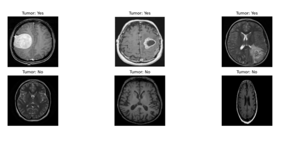
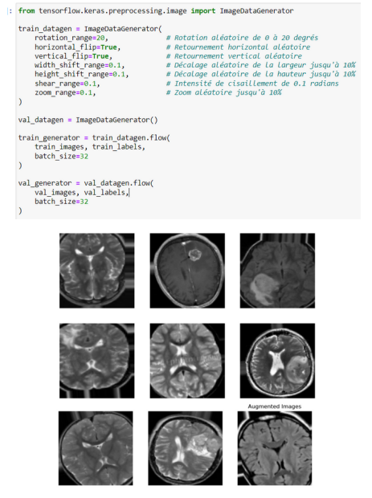
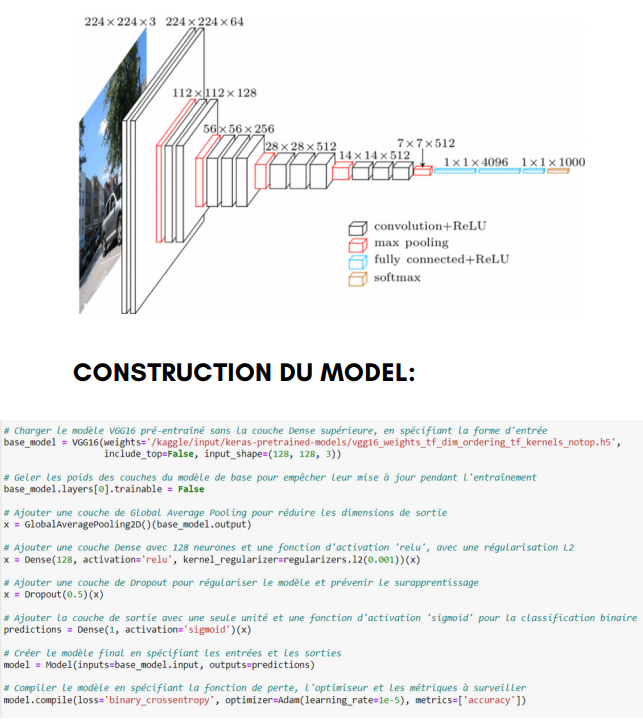
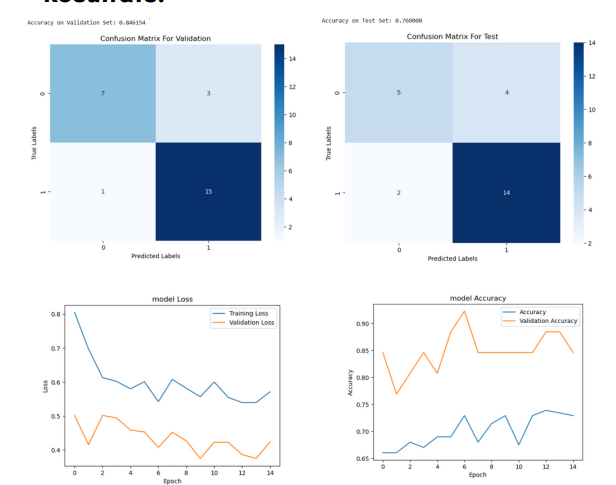
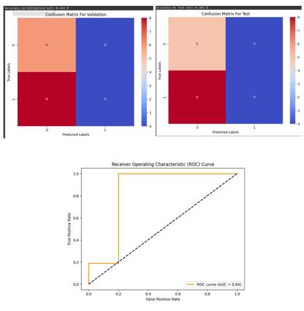
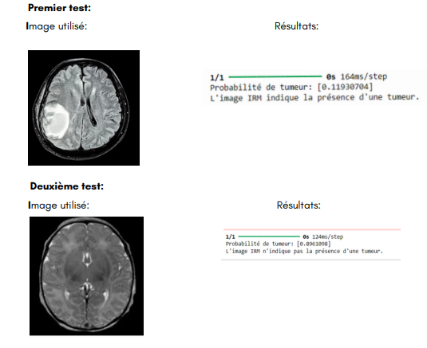

Brain Tumor Detection with Deep Learning
This project focuses on detecting brain tumors using deep learning models. By analyzing MRI images, the system determines the presence or absence of a tumor, leveraging machine learning techniques like transfer learning and Convolutional Neural Networks (CNNs). The models used include VGG-16 and ResNet, known for their high performance in image classification tasks.

Table of Contents
Introduction
Dataset
Preprocessing
Model Architecture
Results
Conclusion
Acknowledgments
Introduction
Brain tumors are abnormal growths in brain cells that can lead to severe neurological symptoms. Timely detection is crucial for early intervention and treatment. This project explores automated tumor detection through image processing, which could assist radiologists and medical professionals in diagnosis.

Dataset
The dataset, sourced from Kaggle, contains 253 MRI images:

Images with tumors: 155
Images without tumors: 98
Each image is labeled to indicate the presence of a tumor, helping the model to learn distinguishing features.

Figure: Sample MRI Image used for tumor detection.

Preprocessing
To enhance model performance, images undergo several preprocessing steps:

Resizing - All images are resized to match the input size required by the model.
Normalization - Pixel values are scaled to improve model convergence.
Data Augmentation - Techniques like rotation, flipping, and zooming are applied to increase data variety and reduce overfitting.

Figure: Examples of data augmentation techniques applied to MRI images.

Model Architecture
This project uses two CNN architectures:

VGG-16: Known for its deep structure with 16 layers, VGG-16 has been pretrained on large datasets and fine-tuned for this specific task. It uses small (3x3) convolution filters to maintain a high level of accuracy.
ResNet: Residual Networks introduce "skip connections," facilitating training for deep networks. This architecture aids efficient gradient propagation, improving accuracy for complex tasks.
Transfer Learning
Transfer learning was implemented by using pretrained models on the ImageNet dataset, allowing these models to retain learned features, then fine-tuning on the brain tumor dataset. This approach improves accuracy and reduces training time.

Figure: VGG-16 Architecture used for tumor classification.

Results
After comparing both architectures, VGG-16 demonstrated superior accuracy and was selected for final implementation. The model was tested on unseen images, yielding promising results in detecting brain tumors with a high confidence level.

Figure: Training accuracy and loss curves for the selected model.

Prediction Examples
Here are examples of the model's predictions on test images:

Figures: Prediction results for sample MRI images, showing tumor presence or absence.

Conclusion
This project highlights the effectiveness of deep learning in medical imaging. The use of CNNs for brain tumor detection provides a foundation for developing tools that assist medical professionals, potentially improving diagnostic accuracy and patient outcomes.

Acknowledgments
Special thanks to Professor Najima Daoudi for her guidance, and to collaborators Ouchen Oualae and Haddioi Souhayla for their contributions to this project.
